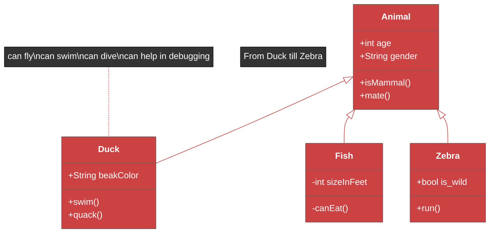

# Class Diagram

```mermaid
%%{
  init: {
    'theme': 'base',
    'themeVariables': {
      'primaryColor': '#CC4141',
      'primaryTextColor': '#fff',
      'lineColor': '#CC4141',
      'secondaryColor': '#AAAAAA',
      'tertiaryColor': '#797979',
      'noteBkgColor': '#333333',
      'noteTextColor': '#fff',
      'sequenceNumberColor': '#333333'
    }
  }
}%%
classDiagram
    note "From Duck till Zebra"
    Animal <|-- Duck
    note for Duck "can fly\ncan swim\ncan dive\ncan help in debugging"
    Animal <|-- Fish
    Animal <|-- Zebra
    Animal: +int age
    Animal: +String gender
    Animal: +isMammal()
    Animal: +mate()
    class Duck {
        +String beakColor
        +swim()
        +quack()
    }
    class Fish {
        -int sizeInFeet
        -canEat()
    }
    class Zebra {
        +bool is_wild
        +run()
    }
```
