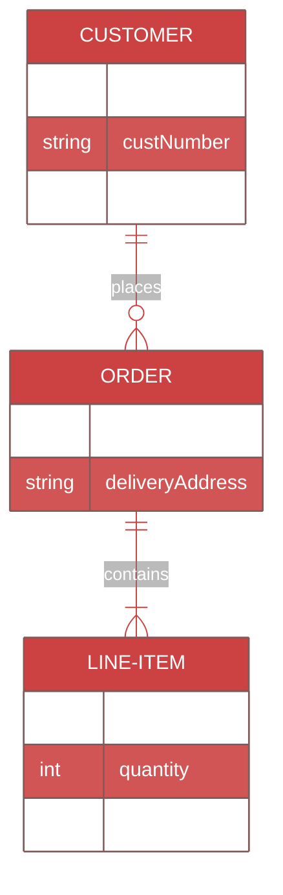

# Entity Relationship Diagram

```mermaid
%%{
  init: {
    'theme': 'base',
    'themeVariables': {
      'primaryColor': '#CC4141',
      'primaryTextColor': '#fff',
      'lineColor': '#CC4141',
      'secondaryColor': '#AAAAAA',
      'tertiaryColor': '#797979',
      'noteBkgColor': '#333333',
      'noteTextColor': '#fff',
      'sequenceNumberColor': '#333333'
    }
  }
}%%

erDiagram
    CUSTOMER ||--o{ ORDER : places
    CUSTOMER {
        string name
        string custNumber
        string sector
    }
    ORDER ||--|{ LINE-ITEM : contains
    ORDER {
        int orderNumber
        string deliveryAddress
    }
    LINE-ITEM {
        string productCode
        int quantity
        float pricePerUnit
    }
```
