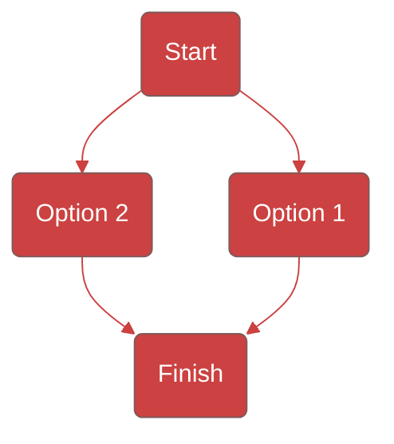

# Flowchart

```mermaid
%%{
  init: {
    'theme': 'base',
    'themeVariables': {
      'primaryColor': '#CC4141',
      'primaryTextColor': '#fff',
      'lineColor': '#CC4141',
      'secondaryColor': '#AAAAAA',
      'tertiaryColor': '#797979',
      'noteBkgColor': '#333333',
      'noteTextColor': '#fff'
    }
  }
}%%
graph TD
    S(Start) --> A(Option 1);
    S --> B(Option 2);
    B --> F(Finish);
    A --> F;
```
