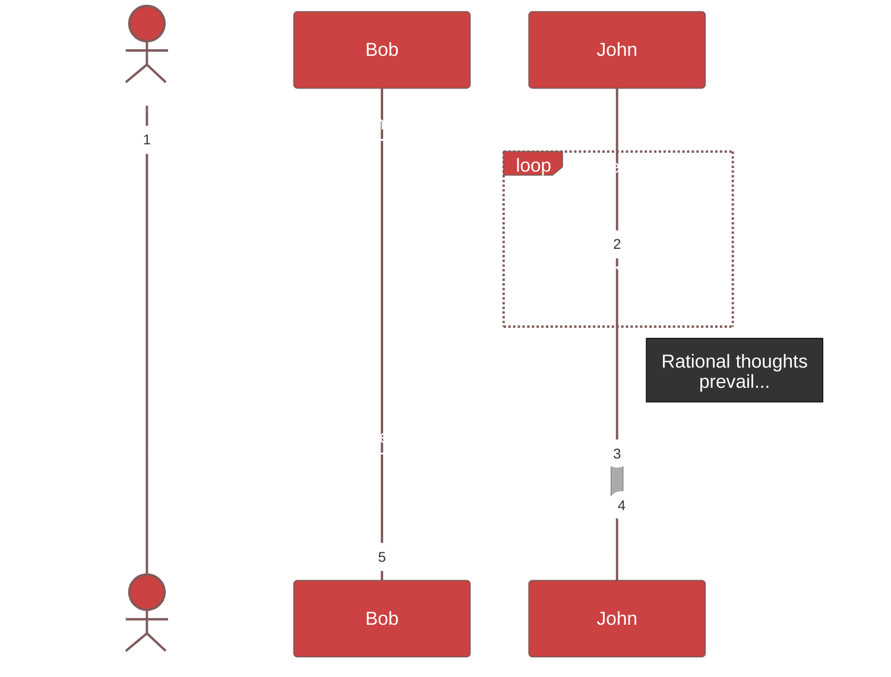

# Sequence Diagram

```mermaid
%%{
  init: {
    'theme': 'base',
    'themeVariables': {
      'primaryColor': '#CC4141',
      'primaryTextColor': '#fff',
      'lineColor': '#CC4141',
      'secondaryColor': '#AAAAAA',
      'tertiaryColor': '#797979',
      'noteBkgColor': '#333333',
      'noteTextColor': '#fff',
      'sequenceNumberColor': '#333333'
    }
  }
}%%

sequenceDiagram
    actor Alice
    participant Bob
    autonumber
    Alice->>John: Hello John, how are you?
    loop Healthcheck
        John->>John: Fight against hypochondria
    end
    Note right of John: Rational thoughts <br/>prevail...
    John-->>Alice: Great!
    activate John
    John->>Bob: How about you?
    deactivate John
    Bob-->>John: Jolly good!
```
